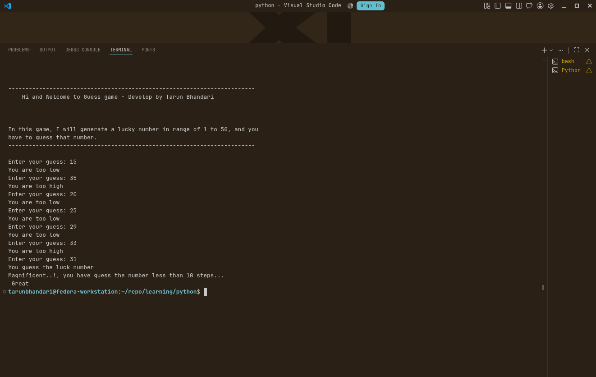

# Welcome

Hi and welcome to my **Python learning** repo. I am learning `python` for the backend development.  

I am using [Python Full course yt video by Apna College](https://youtu.be/q3AuP01daL4?si=xhJEHcg5ZFNxnHND) as the main source of learning apart from the video I am also using chatgpt, [w3school - Python](https://www.w3schools.com/python/) and [learnpython.org](https://www.learnpython.org/) for more information on certain topics.

## Structure

This is structure into following folders and files

```
- assets => To hold the images for the display
- exercise => contains exercise which I have solved
- mini-projects => hold mini projects which I have developed
- notes => which contains the notes

```

## Mini Projects

1. [Calculator](./mini%20projects/calculator.py)

<details>
<summary>Details</summary>
<br>

A simple console based calculator where you will provide two numbers `num1` and `num2` and a operator `+,-,*,/,//` and it will perform the operation on the given number and prodive you the solution.   

It will ask you whether you want to continue or not, if you want to finish/end the project enter `False` or want to continue then `True`. 

<h3>How to run</h3>
<hr> <br>

> [!WARNING] Before following the steps, please make sure to install **Python**

1. Clone the projects in your machine using the `git clone`  

```
git clone https://github.com/thetarun-dev/python-learning.git
```

2. Go to the mini project folder using the terminal and run this command

```python
python calculator.py
```

The project will run...

> [!INFORMATION] For my vscode setting, please refer to this repo [dotfiles repo](https://github.com/thetarun-dev/dotfiles/tree/main/.config/Code/User)


<h3>Images</h3>
<hr><br>


</details>

2. [Guess Game](./mini%20projects/guessing_game.py)

<details>
<summary>Details</summary>
<br>

A simple console based **Guess game**, where the program will generate a luck number ranging from 0 to 50. And you have to guess that number. If you have guess the number less than 10 tries then you are great, if you have guess the number higher than 15 steps then program will give you encouraging words which will helps you 

<h3>How to run</h3>
<hr> <br>

> [!WARNING] Before following the steps, please make sure to install **Python**

1. Clone the projects in your machine using the `git clone`  

```
git clone https://github.com/thetarun-dev/python-learning.git
```

2. Go to the mini project folder using the terminal and run this command

```python
python guessing_game.py
```

The project will run...

> [!INFORMATION] For my vscode setting, please refer to this repo [dotfiles repo](https://github.com/thetarun-dev/dotfiles/tree/main/.config/Code/User)


<h3>Images</h3>
<hr><br>



</details>

