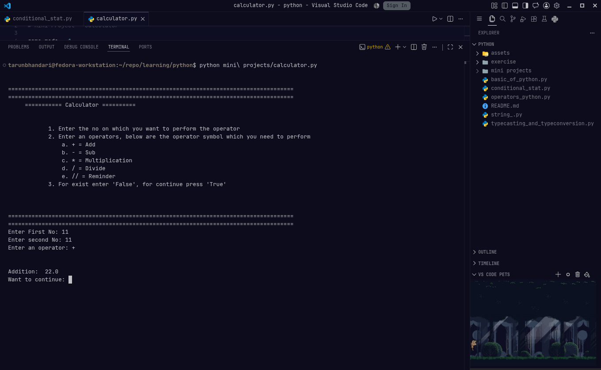
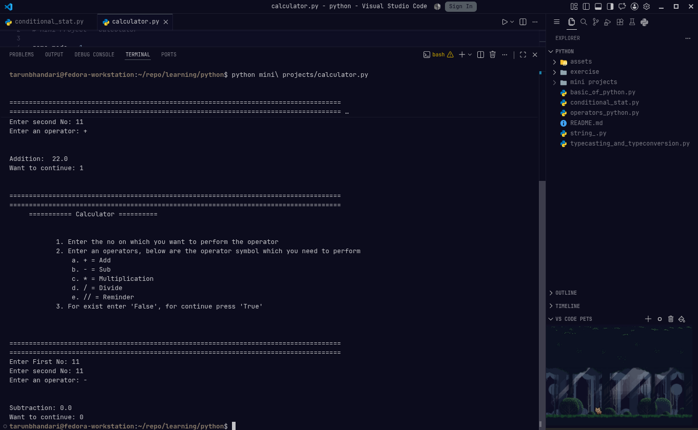

Hi and welcome to my **Python learning journey**

I am using the 2 source to learn first a youtube video from [Apna College](https://youtu.be/q3AuP01daL4?si=xhJEHcg5ZFNxnHND) and [learnpython.org](https://www.learnpython.org/)

**_I have also created mini projects which are present in  mini projects folder_**

## Exercise

> These are the short exercise which I have solved after learning the concepts  

1. [Exercise 1](./exercise/Exercise1.py)
2. [Exercise 2](./exercise/Exercise2.py)
3. [Exercise 3](./exercise/Exercise3.py)
4. [Exercise 4](./exercise/Exercise4.py)

## Mini Projects

1. [Calculator](./mini%20projects/calculator.py)

<details>
<summary>Details</summary>

<h3>How to run</h3>
<hr> <br>

> [!WARNING] Before following the steps, please make sure to install **Python**

1. Clone the projects in your machine using the `git clone`  

```
git clone https://github.com/thetarun-dev/python-learning.git
```

2. Go to the mini project folder using the terminal and run this command

```python
python calculator.py
```

The project will run...

> [Information] For my vscode setting, please refer to this repo [dotfiles repo](https://github.com/thetarun-dev/dotfiles/tree/main/.config/Code/User)


<h3>Images</h3>
<hr><br>





</details>


